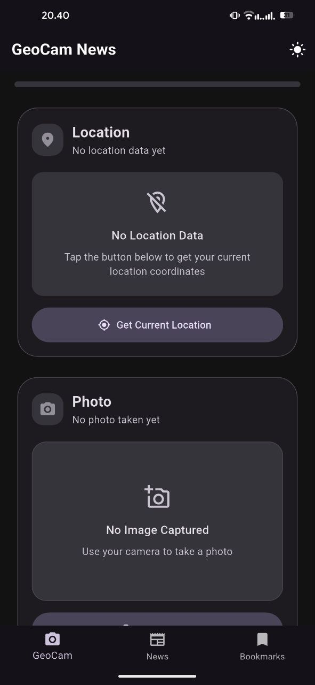

# GeoCam News

A Flutter application that demonstrates location-based photo capture and news browsing with a modern user interface.

## Features

- **Location-based Photography**: Capture photos with precise GPS coordinates
- **News Browsing**: Browse through a collection of news articles
- **Bookmarking System**: Save favorite articles for later reading
- **Theme Support**: Toggle between light and dark themes for better user experience
- **Smooth Animations**: Enjoy fluid transitions and animations throughout the app
- **Offline Support**: Save data locally for offline access

## Architecture

GeoCam News is built with a robust architecture that separates the UI from business logic:

### State Management

The application uses the BLoC pattern with Cubit for efficient state management, providing:

- **Predictable State Updates**: All state changes are tracked and predictable
- **Testable Code**: Business logic is separate from UI for better testing
- **Maintainable Structure**: Clear separation of concerns for easier maintenance
- **Scalable Architecture**: Easy to add new features without extensive refactoring

### Directory Structure

```
lib/
├── cubits/         # State management
│   ├── geocam/      # Location and camera feature state
│   ├── news/        # News and bookmarks state
│   └── theme/       # Theme switching state
├── models/         # Data models
├── screens/        # UI components
├── utils/          # Utility classes
├── widgets/        # Reusable widgets
└── main.dart       # Application entry point
```

## Getting Started

1. Clone the repository
2. Install dependencies:
   ```
   flutter pub get
   ```
3. Run the application:
   ```
   flutter run
   ```

## Project Structure

```
lib/
├── models/         # Data models
│   ├── geocam_model.dart
│   └── news_model.dart
├── cubits/         # State management with BLoC pattern
│   ├── geocam/
│   │   ├── geocam_cubit.dart
│   │   └── geocam_state.dart
│   ├── news/
│   │   ├── news_cubit.dart
│   │   └── news_state.dart
│   └── theme/
│       ├── theme_cubit.dart
│       └── theme_state.dart
├── screens/        # UI components
│   ├── geocam_screen.dart
│   ├── home_screen.dart
│   ├── news_detail_screen.dart
│   ├── news_list_screen.dart
│   └── bookmarks_screen.dart
├── utils/          # Utility classes
│   └── page_transitions.dart
├── widgets/        # Reusable widgets
│   └── network_image_with_fallback.dart
└── main.dart       # Application entry point
```

## Libraries & Dependencies

The application leverages popular Flutter libraries:

| Library                      | Purpose                           |
|------------------------------|-----------------------------------|
| geolocator (^11.0.0)         | Get precise location data         |
| permission_handler (^11.3.0) | Manage device permissions         |
| camera (^0.10.5+9)           | Access device camera              |
| image_picker (^1.0.7)        | Pick images from camera           |
| path_provider (^2.1.2)       | File system access                |
| shared_preferences (^2.2.2)  | Local data storage                |
| http (^1.2.0)                | API requests                      |
| intl (^0.19.0)               | Formatting & internationalization |
| animations (^2.0.10)         | Advanced transition animations    |
| flutter_animate (^4.5.0)     | Declarative animations            |
| flutter_bloc (^8.1.3)        | State management with BLoC        |
| equatable (^2.0.5)           | Efficient state comparison        |

## Required Permissions

The application requires the following permissions:

- **Location** (Fine and Coarse): For capturing precise GPS coordinates
- **Camera**: For taking photos
- **Internet**: For fetching news articles

## Error Handling

GeoCam News implements comprehensive error handling for:

- API failures with retry options
- Permission denials with user guidance
- Device feature unavailability
- Loading state management during async operations

## Screenshots

<table>
  <tr>
    <td align="center"><b>GeoCam</b></td>
    <td align="center"><b>News</b></td>
    <td align="center"><b>Detail</b></td>
    <td align="center"><b>Bookmark</b></td>
    <td align="center"><b>Bookmark Empty</b></td>
  </tr>
  <tr>
    <td></td>
    <td></td>
    <td></td>
    <td></td>
    <td></td>
  </tr>
</table>
